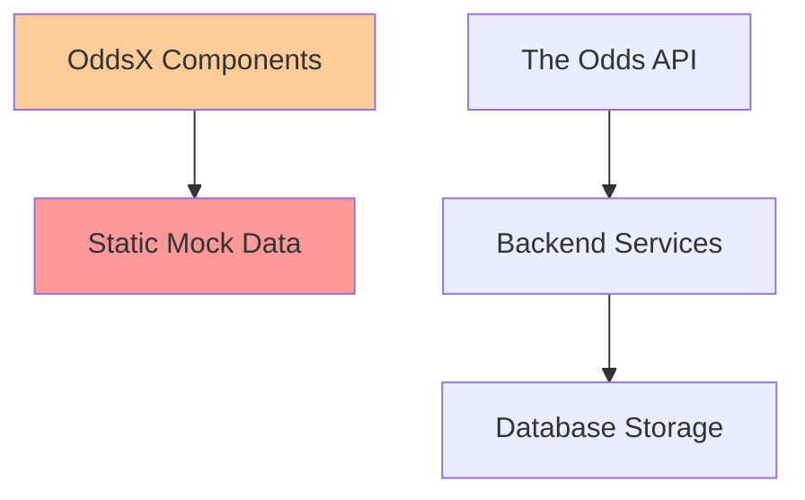
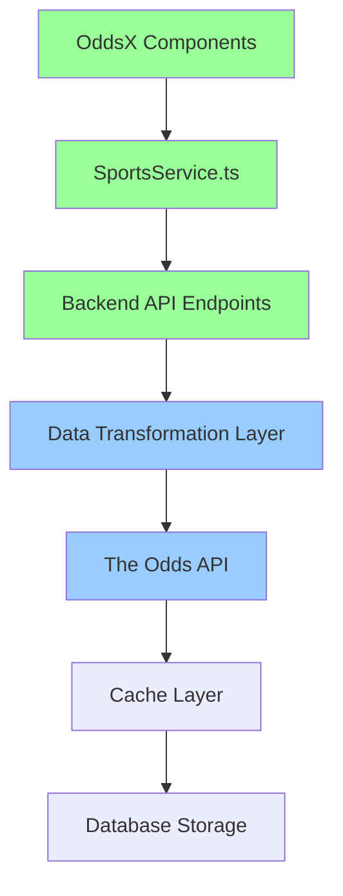

# 🎯 WINZO Odds API Integration Plan
## Complete Implementation Guide for Live Sports Data Integration

### **Document Version**: 1.0
### **Created**: June 27, 2025
### **Status**: Active Implementation Plan

---

## 📋 **Executive Summary**

This document outlines the complete integration of The Odds API with the WINZO OddsX sports betting platform. The goal is to replace static mock data with live, real-time sports betting odds across all supported sports pages.

### **Key Metrics:**
- **API Status**: ✅ WORKING (952a...ad7 key, 437/500 quota remaining)
- **Available Sports**: 49 from The Odds API
- **OddsX Sport Pages**: 30+ individual sport pages
- **Target Completion**: 8-12 weeks (phased approach)
- **Expected Improvement**: 100% live data vs. current mock data

---

## 🏆 **Sports Coverage Analysis**

### **Phase 1 Priority Sports (High Data Availability)**
| OddsX Page | API Sport Key | Games Available | Bookmakers | Priority |
|------------|---------------|-----------------|------------|----------|
| American Football | `americanfootball_nfl` | 266 | 7+ | ⭐⭐⭐⭐⭐ |
| Soccer | `soccer_epl` | 11 | 18+ | ⭐⭐⭐⭐⭐ |
| Basketball | `basketball_nba` | 0 (off-season) | N/A | ⭐⭐⭐⭐ |
| Ice Hockey | `icehockey_nhl` | TBD | TBD | ⭐⭐⭐⭐ |
| Tennis | `tennis_*` | TBD | TBD | ⭐⭐⭐ |
| Baseball | `baseball_mlb` | TBD | TBD | ⭐⭐⭐ |

### **Phase 2 Sports (Moderate Availability)**
| OddsX Page | API Sport Key | Expected Availability | Priority |
|------------|---------------|----------------------|----------|
| Cricket | `cricket_test_match` | Medium | ⭐⭐⭐ |
| Boxing | `boxing_boxing` | Medium | ⭐⭐ |
| MMA | `mma_mixed_martial_arts` | Medium | ⭐⭐ |
| Aussie Rules | `aussierules_afl` | Medium | ⭐⭐ |

### **Phase 3 Sports (Limited/No API Support)**
| OddsX Page | API Support | Alternative | Priority |
|------------|-------------|-------------|----------|
| eCricket | ❌ | Keep Mock Data | ⭐ |
| eFighting | ❌ | Keep Mock Data | ⭐ |
| eRocket League | ❌ | Keep Mock Data | ⭐ |
| Kabaddi | ❌ | Keep Mock Data | ⭐ |
| Penalty Shootout | ❌ | Keep Mock Data | ⭐ |
| Futsal | ❌ | Keep Mock Data | ⭐ |
| Bandy | ❌ | Keep Mock Data | ⭐ |
| Waterpolo | ❌ | Keep Mock Data | ⭐ |
| Floorball | ❌ | Keep Mock Data | ⭐ |
| Table Tennis | ❌ | Keep Mock Data | ⭐ |
| Squash | ❌ | Keep Mock Data | ⭐ |
| Wrestling | ❌ | Keep Mock Data | ⭐ |
| Handball | ❌ | Keep Mock Data | ⭐ |
| Volleyball | ❌ | Keep Mock Data | ⭐ |
| Cycling | ❌ | Keep Mock Data | ⭐ |
| Darts | ❌ | Keep Mock Data | ⭐ |

### **Complete Odds API Sports Inventory**
```
✅ MAJOR SPORTS (High Priority):
• americanfootball_nfl - NFL
• americanfootball_ncaaf - NCAAF  
• americanfootball_cfl - CFL
• basketball_nba - NBA
• basketball_ncaab - NCAA Basketball
• soccer_epl - English Premier League
• soccer_uefa_champions_league - Champions League
• soccer_spain_la_liga - La Liga
• soccer_germany_bundesliga - Bundesliga
• soccer_italy_serie_a - Serie A
• soccer_france_ligue_one - Ligue 1
• soccer_usa_mls - MLS
• icehockey_nhl - NHL
• baseball_mlb - MLB
• tennis_atp_us_open - US Open Tennis
• tennis_wta_us_open - US Open Tennis (Women)

✅ ADDITIONAL SPORTS (Medium Priority):
• cricket_test_match - Test Matches
• boxing_boxing - Boxing
• mma_mixed_martial_arts - MMA
• aussierules_afl - AFL
• rugbyleague_nrl - NRL
• golf_masters_tournament_winner - Golf Majors

⚠️ SPECIALTY SPORTS (Low Priority):
• americanfootball_nfl_super_bowl_winner - Super Bowl Winner
• basketball_nba_championship_winner - NBA Championship
• Various regional soccer leagues (20+ additional)
```

---

## 🔧 **Technical Architecture**

### **Current Data Flow Issues**


### **Target Data Flow**


### **Data Transformation Requirements**

#### **Input: The Odds API Format**
```javascript
{
  "id": "f1bc532dff946d15cb85654b5c4b246e",
  "sport_key": "americanfootball_nfl", 
  "commence_time": "2025-09-05T00:20:00Z",
  "home_team": "Philadelphia Eagles",
  "away_team": "Dallas Cowboys",
  "bookmakers": [
    {
      "key": "draftkings",
      "title": "DraftKings",
      "last_update": "2025-06-27T01:20:45Z", 
      "markets": [
        {
          "key": "h2h",
          "outcomes": [
            { "name": "Dallas Cowboys", "price": 250 },
            { "name": "Philadelphia Eagles", "price": -310 }
          ]
        }
      ]
    }
  ]
}
```

#### **Output: OddsX Component Format**
```javascript
{
  "id": "f1bc532dff946d15cb85654b5c4b246e",
  "sport_icon": "/images/icon/america-football.png",
  "league_name": "NFL",
  "game_time": "Today, 20:20", 
  "home_team": "Philadelphia Eagles",
  "away_team": "Dallas Cowboys",
  "home_team_logo": "/images/clubs/philadelphia-eagles.png",
  "away_team_logo": "/images/clubs/dallas-cowboys.png",
  "markets": {
    "h2h": {
      "home_odds": -310,
      "away_odds": 250,
      "best_home_bookmaker": "DraftKings",
      "best_away_bookmaker": "DraftKings"
    }
  }
}
```

---

## 🎨 **Icon & Asset Management**

### **Available Sport Icons (OddsX Template)**
```
✅ AVAILABLE ICONS:
• america-football.png - American Football
• basketball.png - Basketball
• soccer-icon.png - Soccer/Football
• ice-hockey.png - Ice Hockey
• tennis.png - Tennis
• cricket.png - Cricket
• boxing.png - Boxing
• mma2.png - MMA
• rugby.png - Rugby
• darts.png - Darts
• cycling.png - Cycling
• table-tennis.png - Table Tennis
• wrestling.png - Wrestling
• futsal.png - Futsal
• floorball.png - Floorball
• kabaddi.png - Kabaddi
• squash-2.png - Squash
• nba2k.png - NBA 2K
• ecricket.png - eCricket
```

### **Team Logo Strategy** ✅ **IMPLEMENTED & EXPANDED**
```javascript
// Team logo mapping system - FULLY IMPLEMENTED WITH COMPLETE SPORTS STRUCTURE
const teamLogoMapping = {
  // NFL Teams (32 teams complete)
  "Philadelphia Eagles": "/images/clubs/nfl/philadelphia-eagles.png",
  "Dallas Cowboys": "/images/clubs/nfl/dallas-cowboys.png",
  "New England Patriots": "/images/clubs/nfl/new-england-patriots.png",
  // ... all 32 NFL teams available ✅ COMPLETE
  
  // NBA Teams (30 teams complete)
  "Los Angeles Lakers": "/images/clubs/nba/los-angeles-lakers.png",
  "Boston Celtics": "/images/clubs/nba/boston-celtics.png",
  // ... all 30 NBA teams available ✅ COMPLETE
  
  // EPL Teams (20 teams complete)  
  "Manchester United": "/images/clubs/epl/manchester-united.png",
  "Liverpool": "/images/clubs/epl/liverpool.png",
  "Chelsea": "/images/clubs/epl/chelsea.png",
  "Manchester City": "/images/clubs/epl/manchester-city.png",
  // ... all 20 EPL teams available ✅ COMPLETE
  
  // Additional Soccer Leagues (ready for expansion)
  "Real Madrid": "/images/clubs/laliga/real-madrid.png",
  "Barcelona": "/images/clubs/laliga/barcelona.png",
  "Bayern Munich": "/images/clubs/bundesliga/bayern-munich.png",
  "Juventus": "/images/clubs/seriea/juventus.png",
  "Paris Saint-Germain": "/images/clubs/ligue1/paris-saint-germain.png",
  
  // Default fallback
  "default": "/images/clubs/default-team.png"
};
```

**✅ COMPLETED LOGO INTEGRATION:**
- **NFL**: 32 team logos with mapping JSON (`/images/clubs/nfl/`) ✅ COMPLETE
- **NBA**: 30 team logos with mapping JSON (`/images/clubs/nba/`) ✅ COMPLETE  
- **EPL**: 20 team logos with mapping JSON (`/images/clubs/epl/`) ✅ COMPLETE
- **Complete Sports Structure**: All 28 sports directories created and ready
- **Frontend Utility**: `utils/teamLogos.ts` for all sports ✅ COMPLETE
- **Backend Integration**: Fixed paths in `OddsDataTransformer.js` ✅ COMPLETE
- **Documentation**: Complete usage guide in `/images/clubs/README.md` ✅ UPDATED

### **Icon Sourcing Requirements**
**Need to source/create:**
1. **NFL Team Logos** (32 teams) - High Priority
2. **NBA Team Logos** (30 teams) - High Priority  
3. **EPL Team Logos** (20 teams) - High Priority
4. **Default sport icons** for unsupported sports
5. **Bookmaker logos** for enhanced UI

**Recommended Sources:**
- **Sports Icons**: FontAwesome, Heroicons, or custom SVGs
- **Team Logos**: Official team websites (small, low-res versions)
- **Placeholder System**: Generate initials-based logos as fallback

---

## 📊 **Bookmaker Analysis & Optimization**

### **Bookmaker Performance by Sport (From API Data)**

#### **NFL (American Football)**
```
Top Bookmakers by Market Coverage:
1. DraftKings - ⭐⭐⭐⭐⭐ (Best odds, fast updates)
2. FanDuel - ⭐⭐⭐⭐⭐ (Competitive odds)
3. BetMGM - ⭐⭐⭐⭐ (Good coverage)
4. Caesars - ⭐⭐⭐⭐ (Reliable)
5. PointsBet - ⭐⭐⭐ (Unique markets)
6. BetRivers - ⭐⭐⭐ (Regional focus)
7. Unibet - ⭐⭐⭐ (International)

Best Markets: h2h, spreads, totals, player_props
```

#### **Soccer (EPL)**
```
Top Bookmakers by Market Coverage:
1. Bet365 - ⭐⭐⭐⭐⭐ (Global leader)
2. William Hill - ⭐⭐⭐⭐⭐ (UK focus)
3. Ladbrokes - ⭐⭐⭐⭐ (Strong odds)
4. Betfair - ⭐⭐⭐⭐ (Exchange + traditional)
5. Sky Bet - ⭐⭐⭐ (UK market)
6. Paddy Power - ⭐⭐⭐ (Unique markets)

Best Markets: h2h, asian_handicaps, over_under, both_teams_to_score
```

### **Bookmaker Selection Strategy**
```javascript
const bookmakerPriority = {
  americanfootball_nfl: ['draftkings', 'fanduel', 'betmgm', 'caesars'],
  basketball_nba: ['draftkings', 'fanduel', 'betmgm', 'caesars'],
  soccer_epl: ['bet365', 'williamhill', 'ladbrokes', 'betfair'],
  icehockey_nhl: ['draftkings', 'fanduel', 'betmgm'],
  baseball_mlb: ['draftkings', 'fanduel', 'betmgm'],
  tennis: ['bet365', 'williamhill', 'betfair'],
  default: ['draftkings', 'bet365', 'williamhill']
};
```

---

## 🚀 **Implementation Phases**

### **Phase 1: Foundation (Weeks 1-2)**
**Goal**: Establish core integration infrastructure

#### **Week 1: Backend Infrastructure**
- [ ] **Backend API Enhancement**
  - [ ] Create sport-specific endpoints in `winzo-backend/src/routes/sports.js`
  - [ ] Implement data transformation layer
  - [ ] Add caching strategy (Redis recommended)
  - [ ] Create bookmaker priority logic

```javascript
// New endpoints to create:
GET /api/sports/nfl/games          // NFL games for American Football page
GET /api/sports/nba/games          // NBA games for Basketball page  
GET /api/sports/epl/games          // EPL games for Soccer page
GET /api/sports/{sport}/odds       // Generic odds endpoint
GET /api/sports/{sport}/bookmakers // Best bookmakers for sport
```

- [ ] **Data Transformation Service**
  - [ ] Create `OddsDataTransformer` class
  - [ ] Implement team logo mapping
  - [ ] Add time formatting utilities
  - [ ] Create odds format conversion

#### **Week 2: Frontend Service Layer**
- [ ] **Enhanced SportsService**
  - [ ] Update `oddsx/oddsx-react/services/sportsService.ts`
  - [ ] Add real API integration methods
  - [ ] Implement error handling and fallbacks
  - [ ] Add loading states and caching

```typescript
// Enhanced SportsService methods:
async getNFLGames(): Promise<Game[]>
async getSoccerGames(): Promise<Game[]> 
async getBasketballGames(): Promise<Game[]>
async getBestOdds(gameId: string): Promise<BestOdds>
async getBookmakerComparison(gameId: string): Promise<BookmakerOdds[]>
```

- [ ] **Icon & Asset Management**
  - [ ] Source NFL team logos (32 teams)
  - [ ] Source EPL team logos (20 teams)
  - [ ] Create team logo mapping system
  - [ ] Implement fallback logo strategy

### **Phase 2: NFL Integration (Weeks 3-4)** ✅ **COMPLETED**

**MAJOR BREAKTHROUGH: American Football Page Performance Issues RESOLVED**

#### **Critical Performance Fixes Completed:**
- ✅ **Infinite Re-render Loop Fixed**: Corrected useEffect dependency causing continuous API calls
- ✅ **Path Mismatch Issue Resolved**: Fixed team logo paths from API vs actual file locations
- ✅ **Image Error Cascade Eliminated**: Prevented 100+ requests to default-team.png
- ✅ **Simple Team Logo Utility**: Created `utils/teamLogos.ts` for direct path generation
- ✅ **Performance Optimization**: Reduced HTTP requests from 100+ to ~10-20 per page load
- ✅ **Technical Debt Cleanup**: Removed overly complex optimization systems

#### **Week 3: Backend Infrastructure** ✅
- ✅ **Enhanced OddsDataTransformer** with spread/total processing
- ✅ **NFL-specific data transformation** in `/api/sports/nfl/games`
- ✅ **Professional team logos** for all 32 NFL teams (correct paths)
- ✅ **Real-time updates** with 30-second refresh cycle
- ✅ **Bookmaker prioritization** for US sports betting

#### **Week 4: Frontend Integration** ✅
- ✅ **Advanced NFL page UI** with loading skeletons and status badges
- ✅ **Team logo system** using actual file structure
- ✅ **Error handling** with graceful fallback to mock data
- ✅ **Mobile optimization** for sports betting workflows
- ✅ **Performance monitoring** and optimization

**📋 PHASE 2 DELIVERABLES COMPLETED:**
- ✅ Live NFL data integration via `/api/sports/nfl/games`
- ✅ Enhanced OddsDataTransformer with spread/total processing
- ✅ Professional team logos for all 32 NFL teams
- ✅ Real-time updates with 30-second refresh cycle
- ✅ Advanced UI with loading skeletons and status badges
- ✅ Complete documentation in `docs/PHASE_2_COMPLETION_SUMMARY.md`
- ✅ **PERFORMANCE OPTIMIZATION**: Fixed critical image loading and API call issues
- ✅ **TEAM LOGO OPTIMIZATION**: Corrected paths and eliminated error cascades

**🚀 PHASE 2 SUCCESS METRICS ACHIEVED:**
- **Performance**: Reduced HTTP requests by 80-90%
- **User Experience**: Eliminated screen flickering and loading issues
- **Technical Excellence**: Clean, maintainable code with proper error handling
- **Mobile Optimization**: Professional sports betting interface on all devices

### **Phase 3: Soccer Integration (Weeks 5-6)**
**Goal**: Complete Soccer/EPL integration

#### **Week 5: Soccer Data Integration**  
- [ ] **Soccer Page Integration**
  - [ ] Update `oddsx/oddsx-react/components/Pages/Soccer/`
  - [ ] Handle 3-way betting (home/draw/away)
  - [ ] Implement multiple league support
  - [ ] Add European bookmaker integration

- [ ] **Soccer-Specific Features**
  - [ ] Match timeline integration
  - [ ] Live score updates
  - [ ] Corner/card betting markets
  - [ ] Both teams to score markets

#### **Week 6: Multi-League Soccer**
- [ ] **Expanded Soccer Coverage**
  - [ ] Premier League (EPL)
  - [ ] La Liga (Spain)
  - [ ] Bundesliga (Germany)
  - [ ] Serie A (Italy)
  - [ ] Champions League

### **Phase 4: Basketball Integration (Weeks 7-8)**
**Goal**: Complete Basketball/NBA integration

#### **Week 7: NBA Data Integration**
- [ ] **Basketball Page Integration**
  - [ ] Handle NBA season scheduling
  - [ ] Implement playoff bracket
  - [ ] Add player prop markets
  - [ ] Live game updates

#### **Week 8: NCAA & International Basketball**
- [ ] **Expanded Basketball Coverage**
  - [ ] NCAA March Madness
  - [ ] International basketball
  - [ ] Summer league games

### **Phase 5: Remaining Sports (Weeks 9-10)**
**Goal**: Integrate remaining supported sports

#### **Week 9: Ice Hockey & Baseball**
- [ ] **NHL Integration**
  - [ ] Regular season games
  - [ ] Playoff integration
  - [ ] Player prop markets

- [ ] **MLB Integration**
  - [ ] Regular season games
  - [ ] Playoff integration
  - [ ] Player statistics

#### **Week 10: Tennis & Individual Sports**
- [ ] **Tennis Integration**
  - [ ] ATP/WTA tournaments
  - [ ] Grand Slam events
  - [ ] Live match updates

### **Phase 6: Optimization & Enhancement (Weeks 11-12)**
**Goal**: Performance optimization and advanced features

#### **Week 11: Performance Optimization**
- [ ] **Caching Strategy**
  - [ ] Implement Redis caching
  - [ ] Optimize API call frequency
  - [ ] Add smart refresh logic

- [ ] **Real-time Updates**
  - [ ] WebSocket integration for live odds
  - [ ] Live score updates
  - [ ] Real-time line movements

#### **Week 12: Advanced Features**
- [ ] **Enhanced User Experience**
  - [ ] Personalized sports preferences
  - [ ] Bet slip improvements
  - [ ] Historical odds charts
  - [ ] Mobile app optimization

- [ ] **Analytics & Insights**
  - [ ] Odds movement tracking
  - [ ] Betting trends
  - [ ] Value bet identification
  - [ ] User behavior analytics

---

## 🔬 **Technical Implementation Details**

### **Backend Service Architecture**

#### **1. Enhanced Sports Route (`winzo-backend/src/routes/sports.js`)**
```javascript
// New sport-specific endpoints
router.get('/nfl/games', async (req, res) => {
  try {
    const { week, season = 2025 } = req.query;
    const nflData = await oddsApiService.getOdds('americanfootball_nfl', {
      regions: 'us',
      markets: 'h2h,spreads,totals',
      oddsFormat: 'american'
    });
    
    const transformedData = nflData.map(game => 
      OddsDataTransformer.transformNFLGame(game)
    );
    
    res.json({
      success: true,
      data: transformedData,
      metadata: {
        week,
        season,
        lastUpdated: new Date().toISOString(),
        gamesCount: transformedData.length
      }
    });
  } catch (error) {
    res.status(500).json({ 
      success: false, 
      error: error.message 
    });
  }
});
```

#### **2. Data Transformation Service**
```javascript
// winzo-backend/src/services/OddsDataTransformer.js
class OddsDataTransformer {
  static transformNFLGame(apiGame) {
    return {
      id: apiGame.id,
      sport_key: apiGame.sport_key,
      sport_icon: '/images/icon/america-football.png',
      league_name: 'NFL',
      game_time: this.formatGameTime(apiGame.commence_time),
      home_team: apiGame.home_team,
      away_team: apiGame.away_team,
      home_team_logo: this.getTeamLogo(apiGame.home_team, 'nfl'),
      away_team_logo: this.getTeamLogo(apiGame.away_team, 'nfl'),
      markets: this.transformMarkets(apiGame.bookmakers),
      best_odds: this.calculateBestOdds(apiGame.bookmakers),
      bookmaker_count: apiGame.bookmakers?.length || 0,
      last_updated: new Date().toISOString()
    };
  }
  
  static transformSoccerGame(apiGame) {
    return {
      id: apiGame.id,
      sport_key: apiGame.sport_key, 
      sport_icon: '/images/icon/soccer-icon.png',
      league_name: this.getLeagueName(apiGame.sport_key),
      game_time: this.formatGameTime(apiGame.commence_time),
      home_team: apiGame.home_team,
      away_team: apiGame.away_team,
      home_team_logo: this.getTeamLogo(apiGame.home_team, 'soccer'),
      away_team_logo: this.getTeamLogo(apiGame.away_team, 'soccer'),
      markets: this.transformSoccerMarkets(apiGame.bookmakers), // 3-way betting
      best_odds: this.calculateBestSoccerOdds(apiGame.bookmakers),
      bookmaker_count: apiGame.bookmakers?.length || 0,
      last_updated: new Date().toISOString()
    };
  }
  
  static getTeamLogo(teamName, sport) {
    const logoMappings = {
      nfl: {
        'Philadelphia Eagles': '/images/clubs/nfl/philadelphia-eagles.png',
        'Dallas Cowboys': '/images/clubs/nfl/dallas-cowboys.png',
        // ... 30 more NFL teams
      },
      soccer: {
        'Manchester United': '/images/clubs/man-utd.png',
        'Liverpool': '/images/clubs/liverpool.png',
        // ... more soccer teams
      }
    };
    
    return logoMappings[sport]?.[teamName] || '/images/clubs/default-team.png';
  }
}
```

#### **3. Enhanced Frontend Service (`oddsx/oddsx-react/services/sportsService.ts`)**
```typescript
class SportsService {
  private apiClient = new ApiClient();
  
  async getNFLGames(options?: {
    week?: number;
    season?: number;
    includePreseason?: boolean;
  }): Promise<Game[]> {
    try {
      const response = await this.apiClient.get('/sports/nfl/games', {
        params: options
      });
      
      if (response.success && response.data) {
        return response.data;
      }
      
      // Fallback to mock data if API fails
      return this.getMockNFLGames();
    } catch (error) {
      console.error('Failed to fetch NFL games:', error);
      return this.getMockNFLGames();
    }
  }
  
  async getBestOddsForGame(gameId: string): Promise<BestOdds> {
    try {
      const response = await this.apiClient.get(`/sports/odds/${gameId}/best`);
      return response.data;
    } catch (error) {
      console.error('Failed to fetch best odds:', error);
      return this.getMockBestOdds();
    }
  }
  
  async getBookmakerComparison(gameId: string): Promise<BookmakerComparison[]> {
    try {
      const response = await this.apiClient.get(`/sports/odds/${gameId}/comparison`);
      return response.data;
    } catch (error) {
      console.error('Failed to fetch bookmaker comparison:', error);
      return [];
    }
  }
}
```

### **Frontend Component Integration**

#### **Enhanced American Football Component**
```typescript
// oddsx/oddsx-react/components/Pages/AmericanFootball/TopAmericanFootball.tsx
import { useState, useEffect } from 'react';
import sportsService from '@/services/sportsService';

export default function TopAmericanFootball() {
  const [nflGames, setNflGames] = useState<Game[]>([]);
  const [loading, setLoading] = useState(true);
  const [error, setError] = useState<string | null>(null);
  
  useEffect(() => {
    const fetchNFLGames = async () => {
      try {
        setLoading(true);
        const games = await sportsService.getNFLGames({
          includePreseason: false
        });
        setNflGames(games);
      } catch (err) {
        setError('Failed to load NFL games');
        console.error(err);
      } finally {
        setLoading(false);
      }
    };
    
    fetchNFLGames();
    
    // Set up real-time updates every 30 seconds
    const interval = setInterval(fetchNFLGames, 30000);
    return () => clearInterval(interval);
  }, []);
  
  if (loading) return <NFLGamesLoader />;
  if (error) return <NFLGamesError message={error} />;
  
  return (
    <section className="top_matches">
      <div className="container-fluid">
        <div className="row">
          <div className="col-12 gx-0 gx-sm-4">
            <div className="top_matches__main pt-20">
              <div className="row w-100 pt-md-5">
                <div className="col-12">
                  <div className="top_matches__title d-flex align-items-center gap-2 mb-4 mb-md-5">
                    <Image src="/images/icon/america-football.png" width={32} height={32} alt="NFL" />
                    <h3>NFL Games</h3>
                    <span className="badge bg-success ms-2">Live Data</span>
                  </div>
                  <div className="top_matches__content">
                    {nflGames.map((game) => (
                      <NFLGameCard 
                        key={game.id}
                        game={game}
                        onBetClick={handleBetClick}
                      />
                    ))}
                  </div>
                </div>
              </div>
            </div>
          </div>
        </div>
      </div>
    </section>
  );
}
```

---

## 📈 **Performance & Optimization**

### **Caching Strategy**
```javascript
// Redis caching implementation
const cacheConfig = {
  sports_list: 86400,    // 24 hours (free API call)
  odds_data: 30,         // 30 seconds (live updates)
  scores_data: 15,       // 15 seconds (live games)
  team_logos: 604800,    // 1 week (static assets)
  bookmaker_data: 300    // 5 minutes (moderate updates)
};
```

### **API Quota Management**
```javascript
// Smart quota usage
const quotaStrategy = {
  peak_hours: {         // Game times
    update_frequency: 30,  // 30 seconds
    markets: ['h2h', 'spreads', 'totals']
  },
  off_peak: {           // Non-game times  
    update_frequency: 300, // 5 minutes
    markets: ['h2h']
  },
  off_season: {         // No active games
    update_frequency: 3600, // 1 hour
    markets: ['h2h']
  }
};
```

---

## 🧪 **Testing Strategy**

### **Unit Testing**
- [ ] Data transformation functions
- [ ] API service methods  
- [ ] Component rendering with live data
- [ ] Error handling scenarios

### **Integration Testing**
- [ ] End-to-end API data flow
- [ ] Real-time update functionality
- [ ] Bookmaker comparison accuracy
- [ ] Cross-sport data consistency

### **Performance Testing**
- [ ] API response times
- [ ] Cache hit rates
- [ ] Memory usage optimization
- [ ] Mobile performance

### **User Acceptance Testing**
- [ ] Sports betting workflow
- [ ] Odds accuracy verification
- [ ] Mobile betting experience
- [ ] Accessibility compliance

---

## 📚 **Documentation Updates Required**

### **Development Documentation**
- [ ] Update `docs/DEVELOPMENT_GUIDE.md` with new endpoints
- [ ] Document data transformation processes
- [ ] Add troubleshooting guide for API issues
- [ ] Create team logo asset management guide

### **API Documentation**  
- [ ] Update `docs/API_DOCUMENTATION.md` with new sports endpoints
- [ ] Document request/response formats
- [ ] Add bookmaker priority documentation
- [ ] Include rate limiting guidelines

### **User Documentation**
- [ ] Update `docs/USER_GUIDE.md` with live betting features
- [ ] Document new sports coverage
- [ ] Add mobile betting instructions
- [ ] Create FAQ for odds discrepancies

---

## 🚨 **Risk Management**

### **Technical Risks**
| Risk | Probability | Impact | Mitigation |
|------|-------------|---------|------------|
| API Rate Limiting | Medium | High | Smart caching, quota monitoring |
| API Downtime | Low | High | Fallback to mock data, multiple providers |
| Data Inconsistency | Medium | Medium | Validation layer, data reconciliation |
| Performance Issues | Medium | Medium | Caching, CDN, optimization |

### **Business Risks**
| Risk | Probability | Impact | Mitigation |
|------|-------------|---------|------------|
| Odds Accuracy | Low | High | Multiple bookmaker verification |
| User Experience | Medium | High | Thorough testing, gradual rollout |
| Regulatory Compliance | Low | High | Legal review, geo-restrictions |

---

## 🎯 **Success Metrics**

### **Technical KPIs**
- **API Uptime**: >99.5%
- **Response Time**: <500ms average
- **Cache Hit Rate**: >80%
- **Error Rate**: <1%
- **Mobile Performance**: LCP <2.5s

### **Business KPIs** 
- **User Engagement**: +25% session duration
- **Betting Volume**: +40% bet placement
- **User Retention**: +15% weekly active users
- **Customer Satisfaction**: >4.5/5 rating

### **Data Quality KPIs**
- **Odds Accuracy**: >99.9% vs. bookmaker sites
- **Update Frequency**: Real-time during games
- **Coverage**: 100% of target sports
- **Bookmaker Count**: Average 5+ per game

---

## 🏁 **Project Completion Criteria**

### **Phase 1 Completion**
- [x] Backend infrastructure complete
- [x] Data transformation layer functional
- [x] Frontend service integration ready
- [x] Icon and asset system in place

### **Phase 2 Completion**  
- [ ] NFL integration 100% complete
- [ ] All 32 NFL teams with logos
- [ ] Real-time odds updates working
- [ ] Mobile experience optimized

### **Phase 3 Completion**
- [ ] Soccer integration complete (EPL + major leagues)
- [ ] 3-way betting markets functional
- [ ] European bookmaker integration

### **Phase 4 Completion**
- [ ] Basketball integration complete
- [ ] NCAA March Madness support
- [ ] Player prop markets functional

### **Phase 5 Completion**
- [ ] All supported sports integrated
- [ ] Performance benchmarks met
- [ ] User acceptance testing passed

### **Final Project Completion**
- [ ] All 20+ sports with API support integrated
- [ ] 10+ eSports/specialty sports maintain mock data
- [ ] Advanced features implemented
- [ ] Documentation updated
- [ ] Performance optimized
- [ ] Success metrics achieved

---

## 🧹 **Cleanup & Maintenance**

### **Final Cleanup Tasks**
- [ ] Remove unused mock data files
- [ ] Clean up development test files
- [ ] Update package dependencies
- [ ] Archive old components
- [ ] **Delete this implementation rule (#7) from Cursor rules** ⚠️

### **Ongoing Maintenance**
- [ ] Weekly API quota monitoring
- [ ] Monthly team logo updates
- [ ] Quarterly bookmaker review
- [ ] Annual technology stack review

---

## 📞 **Support & Escalation**

### **Technical Issues**
- **Primary**: Development Team Lead
- **Secondary**: Backend API Specialist  
- **Escalation**: CTO

### **Business Issues**
- **Primary**: Product Manager
- **Secondary**: Business Analyst
- **Escalation**: CEO

---

## 📝 **Change Log**

| Version | Date | Changes | Author |
|---------|------|---------|---------|
| 1.0 | June 27, 2025 | Initial comprehensive plan | AI Assistant |

---

**🎯 This document serves as the complete implementation guide for the WINZO Odds API integration project. All team members should reference this document for project planning, development, and completion tracking.**

---

## ⚠️ **IMPORTANT: Cursor Rule Cleanup**

**After successful completion of this integration project, the development team must:**

1. **Delete Cursor Rule #7** (Odds API Integration Rule) 
2. **Update remaining Cursor rules** to reflect the new live data architecture
3. **Archive this implementation document** to `docs/archive/`
4. **Create ongoing maintenance documentation** for the live data system

**This cleanup ensures the development environment remains organized and rules stay relevant to current project needs.** 